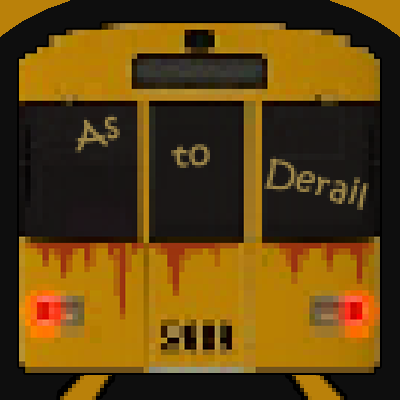

# As to Derail (Student Project)

Homepage: https://s4g.itch.io/as-to-derail

#### 3D first person Horror Expierence made in Unity

Our game  is a spooky adventure through a Berlin based subway system. 

#### Roles
- Gameplay Programmer

#### Engine / Language
- Unity, C#

#### Responsiblities
- [Implement the Sanity system](./Source/Assets/_OBJECTS/_Life/Player/Scripts/Sanity)
- [Implement PlayerStatus](./Source/Assets/_OBJECTS/_Life/Player/Scripts/PlayerStatus)
- [Implement the Train](./Source/Assets/_OBJECTS/Train/Scripts)
- [Implement a clock which works with computer time](./Source/Assets/_OBJECTS/Clock/Scripts)
- [Implement a Vending machine to restore youre Sanity](./Source/Assets/_OBJECTS/VendingMachine)

[Download](https://s4g.itch.io/as-to-derail/purchase)
